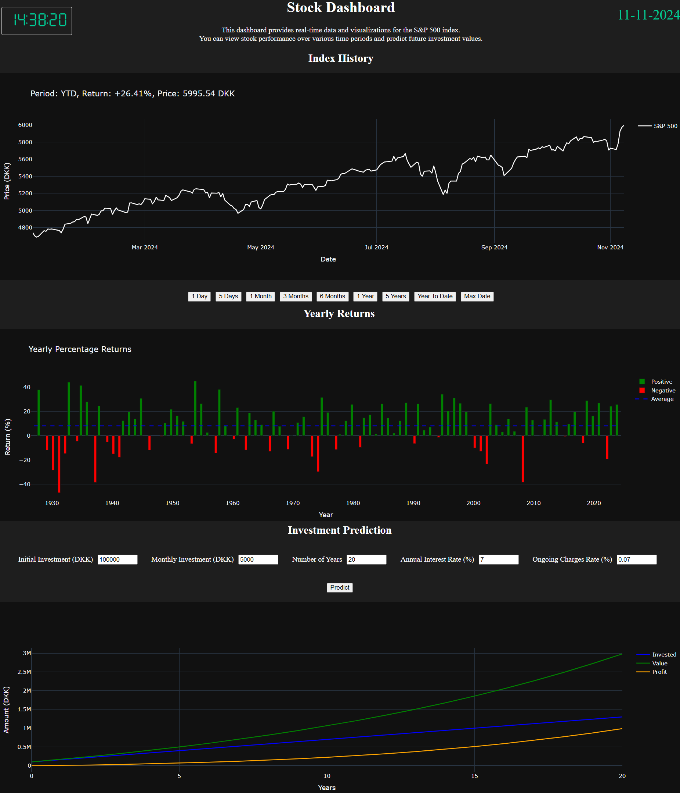

# Stock Market Dashboard 📉📈
This project is a web-based dashboard for visualizing S&P 500 index data. It offers real-time stock data, historical performance visualization, and investment prediction tools. The dashboard is deployed on Render, enabling continuous deployment from a GitHub repository.

### Table of Contents 📖
- [Structure](#structure) 📂
- [Features](#features) 🧠
- [Installation](#installation) 📦
- [Requirements](#requirements) 📑
- [Execution](#execution) 🏃‍♂️
- [Developer](#developer) 👤

### Structure
```
┌── src                         <-- Source Folder
|   └── *.py                    <-- Source Files
|
├── .gitignore                  <-- Git Ignore Configuration
|
├── .pre-commit-config.yaml     <-- Pre-Commit Configuration
|
├── readme.md                   <-- You Are Here
|
├── render.yaml                 <-- Render Configuration
|
├── requirements.txt            <-- Package Requirements
|
└── stocks.py                   <-- Main Python Script
```

### Features
- **Real-time Data**: Displays real-time stock data for the S&P 500 index.
- **Historical Performance**: Visualizes historical stock performance over various time periods.
- **Investment Prediction**: Provides tools for predicting future investment values.
- **Clock and Date**: Displays the current time and date on the dashboard.

### Preview


### Installation
1. Create a user account on [GitHub](https://github.com/) if you don't already have one.
2. Create a new repository on GitHub for your project and push your code to it.
3. Create a user account on [Render](https://render.com/).
4. Connect your GitHub account to Render by granting it access to your repository.
5. Use Render to build and deploy your application from the GitHub repository:
   - Select "New +" and choose "Web Service"
   - Connect to your GitHub repository
   - Configure the build and start command
   - Choose a plan and deploy
6. Once deployed, share the web link provided at the top of the page to access your dashboard.

This setup allows for continuous deployment, where changes pushed to your GitHub repository will automatically trigger a new build and deployment on Render.

### Requirements
Execute `pip install -r requirements.txt` to install the required libraries.

### Execution
Execute `python stocks.py` to run the dashboard locally.

### Developer
Execute `python -m pre_commit run --all-files` to ensure code quality and formatting checks.
